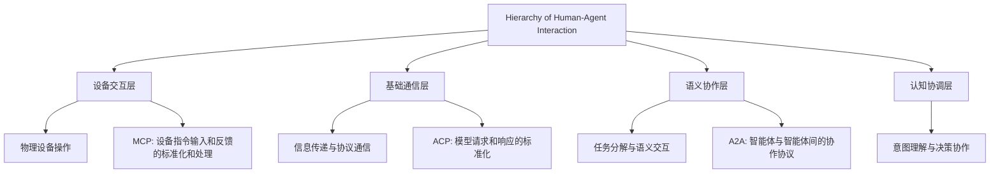

关于ai时代诞生的一些协议

自从20年的ai元年以来 诞生了很多新的概念和产品 这里就简单阐述一下我关注到的比较有意义的三个全新的通信协议

① MCP

MCP（Model Context Protocol）是一种使大模型能够与终端用户或其他模型交互的协议。通过MCP，模型可以获取上下文信息，例如来自不同平台的数据，实现更高效的操作。例如，用户可以使用自然语言指令与模型互动，而模型则可以通过设备执行具体任务（如 "将平台升高2米" 或 "将扳手向右旋转4毫米"）。该协议的核心思想是为模型提供一个标准化的接口，以在多平台环境中进行交互并更好地操作工具。这种标准化方式非常类似于ACP，解耦了智能体所需的信息接口，提高了通用性和扩展性。

② A2A

A2A（Agent-to-Agent Protocol）是支持终端用户或其他智能体与工作智能体（例如维修智能体、计算智能体等）进行交互的协议。A2A协议关注智能体之间的信息交换和决策协作，其设计目的是构建一种自然、灵活、高效的智能体协同环境。例如，应用A2A协议后，智能助手可以与编程智能体（如支持ACP的智能体）联动，实现更复杂的任务拆解与协作。

③ ACP

Agent Client Protocol (ACP) 是用于连接代码编辑器和 Agent 的协议，对代码编辑器（用于查看和编辑源代码的交互式程序）与编码 Agent（使用生成式 AI 自主修改代码的程序）之间的通信进行了标准化。这一协议让开发者可以在编辑器中自由接入任意第三方智能体（Agent），无需依赖官方内置工具。其理念类似于语言服务器协议（LSP），通过解耦编辑器与 Agent 的交互方式，提供更灵活的扩展能力。

人类与智能体交互层级分析

通过上述Mermaid图可以看出，MCP、ACP和A2A协议分别对应不同的交互层级并具有各自的意义：

1.  **设备交互层 (MCP)**: 用于连接大模型和具体设备（例如一个机械臂），解决物理环境反馈和具体请求的对接问题，从而增强大模型处理设备侧任务的能力。
    
2.  **基础通信层 (ACP)**: 为智能体和客户端（如代码编辑器）之间的通信提供标准接口，实现了客户终端对模型功能的扩展，解耦了模型与工具，增强了灵活性。
    
3.  **语义协作层 (A2A)**: 解决多个智能体之间协作的问题，例如一个维修智能体与导航智能体之间的工程协同。它通过标准化智能体之间的语义和任务共享机制，为复杂的环境提供支持。
    
4.  **认知协调层**: 涉及智能体对用户意图的理解及决策支持，当前主要依赖高等级模型协调能力，但未来可能会在协议层级进行更广泛的标准和分析。